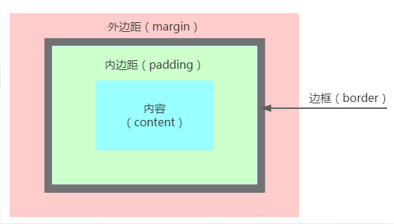
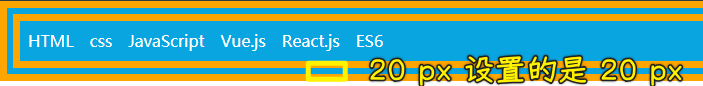

### ✍️ Tangxt ⏳ 2021-09-27 🏷️ CSS

# Cheat Sheet

## ★CSS基础语法与选择器

## ★文本与字体


## ★盒子模型 & 浮动定位

1）盒模型计算



- 盒子的空间大小：内容宽/高 + 两侧内边距 + 两侧边框
- 盒子的实际大小：内容宽/高 + 两侧内边距 + 两侧边框 +两侧外边距

内容可以是文字、图片，也可以是另外一个元素

2）`border`简写属性书写顺序

线宽 -> 线型（点线、虚线、实线、两个边框`double`） -> 颜色



3）清除浮动

使用`after`伪元素

``` html
<!DOCTYPE html>
<html lang="en">

<head>
  <meta charset="UTF-8">
  <title></title>
  <style>
    .clearfix:after {
      /*伪元素是行内元素 正常浏览器清除浮动方法*/
      content: "";
      display: block;
      height: 0;
      clear: both;
      visibility: hidden;
    }

    .clearfix {
      *zoom: 1;
      /*ie6 清除浮动的方式 *号只有 IE6-IE7 执行，其他浏览器不执行*/
    }
  </style>
</head>

<body>
  <div class="fahter clearfix">
    <div class="big"></div>
    <div class="small"></div>
  </div>
</body>

</html>
```

4）`background`属性

语法：

``` md
background:background-color background-image background-position/background-size background-repeat;
```

示例：

``` css
body{ 
   background: #00ff00 url('smiley.gif') no-repeat center; 
}
```

💡：`background-size`？

指定背景图像的大小 -> `background-size:80px 60px;`

它的常用属性值：

- cover：保持图像的纵横比并将图像缩放成将完全覆盖背景设定区域的大小
- length：设置背景图片高度和宽度，第一个值设置宽度，第二个值设置的高度。如果只给出一个值，第二个是自动设置为 auto
